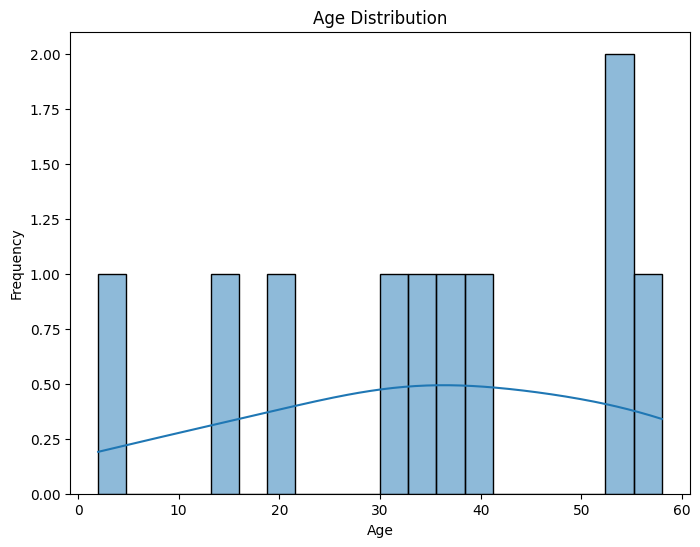
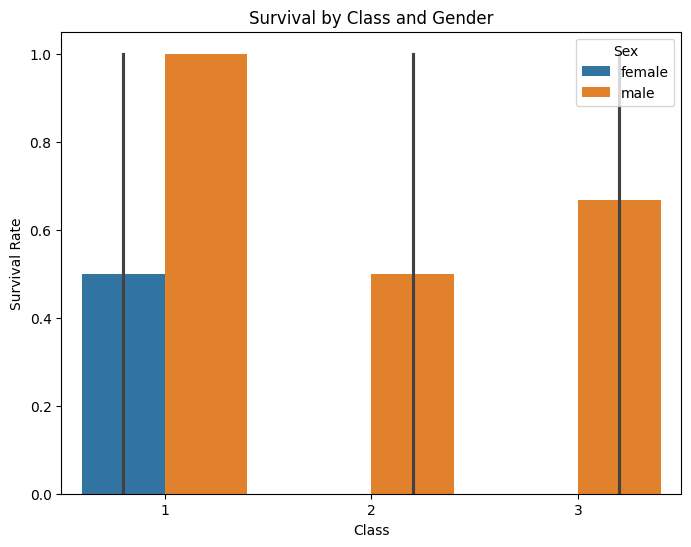
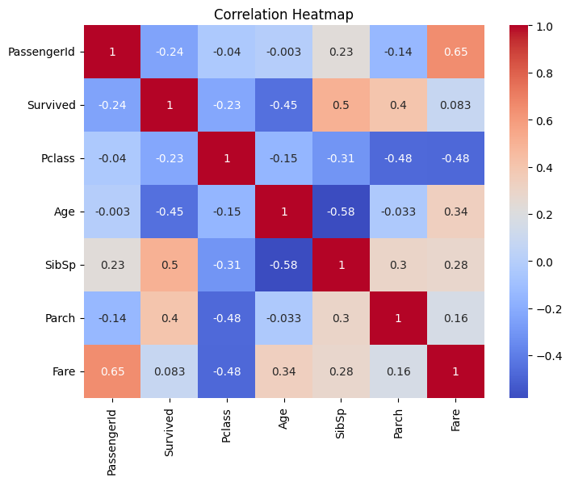

# 🛳️ Titanic Dataset Analysis

This project analyzes the Titanic dataset to explore factors that influenced passenger survival during the ship's tragic voyage. The analysis was performed in Google Colab using Python and data visualization libraries like Pandas, Seaborn, and Matplotlib.

---

## 📁 Dataset

The dataset used is a version of the classic Titanic dataset containing the following columns:

- `PassengerId`
- `Survived`
- `Pclass`
- `Name`
- `Sex`
- `Age`
- `SibSp`
- `Parch`
- `Ticket`
- `Fare`
- `Cabin` (Dropped due to high null values)
- `Embarked`

> 📌 Note: The dataset file used is named `dataset3 - Sheet1.csv`.

---

## 🧪 Project Structure

- **Data Cleaning**
  - Handled missing values (`Cabin` dropped due to ~70% nulls)
  - Checked and managed duplicate records

- **Data Aggregation**
  - Survival rate analyzed by `Sex`, `Pclass`, and combinations

## Data Visualizations

### Age Distribution

### Survival by Class and Gender

### Correlation Heatmap

---

## 📊 Key Insights

- **Gender Impact**: Males had a much higher survival rate compared to females.
- **Class Impact**: Passengers in 1st class had significantly higher survival chances than those in 2nd or 3rd class.
- **Combined Impact**: 1st class males had the highest survival rates; 3rd class females had the lowest.
- **Age Distribution**: Most passengers were between 20–40 years old.
- **Fare & Pclass Correlation**: Higher fare and lower class number (i.e., 1st class) correlated positively with survival.

---

## 🛠️ Technologies Used

- **Python 3**
- **Pandas**
- **NumPy**
- **Matplotlib**
- **Seaborn**
- **Google Colab**

---

## 📌 How to Run

1. Upload the dataset (`dataset3 - Sheet1.csv`) to your Colab session.
2. Open the `analyzing_titanic_dataset.py` or copy the code into a new Google Colab notebook.
3. Run each cell sequentially to perform cleaning, analysis, and visualization.

---

## 📈 Output Visuals

- Histogram showing passenger age distribution.
- Bar plot of survival rate grouped by class and gender.
- Correlation heatmap for all numerical variables.

---

## 📂 Files Included

- `analyzing_titanic_dataset.py` – Main Python CLI script  
- `dataset3 - Sheet1.csv` – Saved student data  
- `README.md` – Project instructions

---

## 🚀 Author

**Madhav Ganorkar**  
Assignments (EDA Deep Dive) – Masai School

